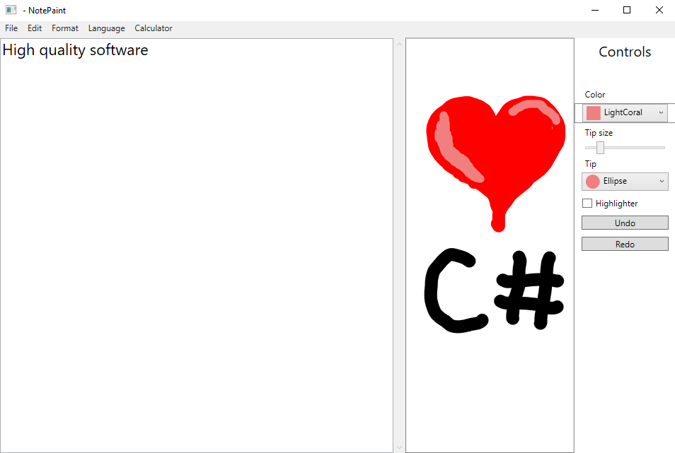

# Notepaint

If notepad and paint were relatives and they would have a kid. 

Have you always wanted the text editing capabilities of notepad and the image editing capabilities of Microsoft Paint, plus some calculator stuff all in one packet? Look no further!

## Highlights
* Many colors to choose from.
* Two paint tips = high quality
* Highlighter
* Custom file extension .npt. Saves text and stroke data into one file. Identified by `0xF3F2F1` header. High quality.
* Calculator to add some number to your text files. Useful for... TODO figure some reason here
* Menus for english and swedish because why not
* Change font size, font color, undo, redo
* Print your text document
